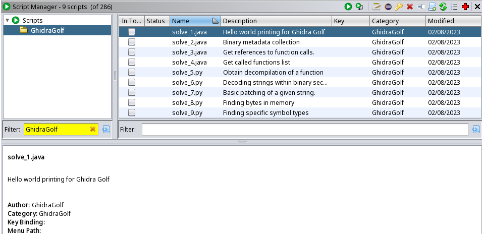

## Putting Green
The "Putting Green" are a series of entry level Ghidra Scripting challenges designed to get a competitor familiar with Ghidra's [FlatProgramAPI](https://ghidra.re/ghidra_docs/api/ghidra/program/flatapi/FlatProgramAPI.html).

These series of 9 challenges walk a competitor through different scripting scenarios to include patching, searching, metadata extraction, and symbol enumeration. From challenge 1 through 4 a template script is provided to the competitor. Challenges 5 on wards require writing your own in either Python or Java. A description of the challenges can be seen below with corresponding "solve scripts" available in [./solves](./solves).

These challenges and associated solve scripts are being Open Sourced in hopes of future competition organizers leveraging them in their own Ghidra Golf Competition or inspiring them for similar challenges.

## Challenge Description

* [1-helloworld](./challenges/1-helloworld): submit a Ghidra Script to simply print Hello World to understand the Ghidra Script submission process.
  * Note, if using python, ```println``` has to be used to get captured in [analyzeHeadless](https://github.com/NationalSecurityAgency/ghidra/blob/master/Ghidra/RuntimeScripts/Linux/support/analyzeHeadless)' ```-scriptLog``` output.
  
* [2-ghidra-metadata](./challenges/2-ghidra-metadata): Obtain metadata about the currently loaded program.

* [3-references](./challenges/3-references): Obtain references to a given function/address.

* [4-called-functions](./challenges/4-called-functions): Identify functions that call a specific function.

* [5-decompiler](./challenges/5-decompiler): programatically print out Ghidra's decompilation of a function.

* [6-defined-data](./challenges/6-defined-data): Enumerate values in different sections of the binary.

* [7-hello-patch](./challenges/7-hello-patch): Patch specific bytes within a binary.

* [8-evil-bytes](./challenges/8-evil-bytes): Identify the evil bytes and print the offset within a binary.

* [9-class-function](./challenges/9-class-functions): Enumerate methods of given classes.


## Ghidra Scripts
Reference the steps provided in the [ghidra_scripts](https://github.com/ghidragolf/ghidra_scripts) repo for how to add a directory to your Ghidra Script search path. The Ghidra Scripts are identifiable from the GhidraGolf category as shown below.


